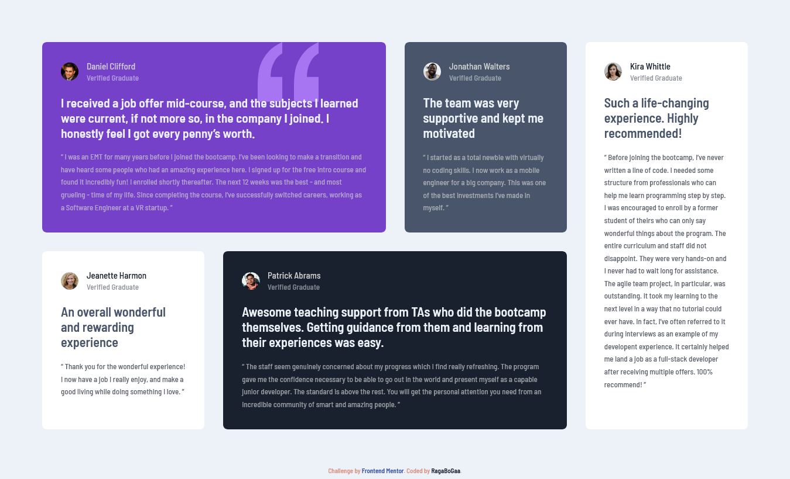

# Frontend Mentor - Testimonials grid section solution

This is a solution to the [Testimonials grid section challenge on Frontend Mentor](https://www.frontendmentor.io/challenges/testimonials-grid-section-Nnw6J7Un7). Frontend Mentor challenges help you improve your coding skills by building realistic projects.

## Table of contents

- [Overview](#overview)
  - [The challenge](#the-challenge)
  - [Screenshot](#screenshot)
  - [Links](#links)
  - [Built with](#built-with)
  - [What I learned](#what-i-learned)
- [Author](#author)

## Overview

### The challenge

Users should be able to:

- View the optimal layout for the site depending on their device's screen size

### Screenshot

### Links

- Solution URL: [On frontend mentor](https://www.frontendmentor.io/solutions/testimonials-grid-section-solution-css-grid-kF2jmFi6h)
- Live Site URL: [Via Github Pages](https://ragabogaa.github.io/testimonials-grid-section-main/)

### Built with

- CSS Grid
- Mobile-first workflow
- Semantic HTML5 markup
- CSS custom properties

### What I learned

Practiced more and more the CSS Grid

## Author

- Frontend Mentor - [@RagaBoGaa](https://www.frontendmentor.io/profile/RagaBoGaa)
